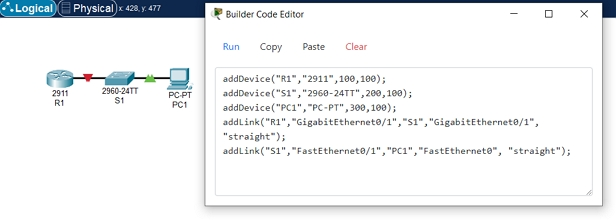
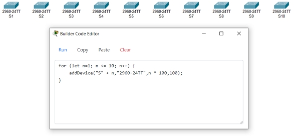

# Packet Tracer Builder

Packet Tracer Builder is an extension that allows you to use JavaScript code to create networks.

It provides a code editor window and a set of simple functions that can be called to create, configure, and link devices.

For example:

```
addDevice("R1","2911",100,100);
addDevice("S1","2960-24TT",200,100);
addDevice("PC1","PC-PT",300,100);
addLink("R1","GigabitEthernet0/1","S1","GigabitEthernet0/1", "straight");
addLink("S1","FastEthernet0/1","PC1","FastEthernet0", "straight");
```

Produces:



You can also use loops and other JavaScript features to automate it. For example, to create 10 switches:

```
for (let n=1; n <= 10; n++) {
    addDevice("S" + n,"2960-24TT",n * 100,100);
}
```

Produces:



**Wait, but why???**

This was dreamt up as a method to allow **AI chatbots** to **automate** the **creation** of **Packet Tracer networks**.

## Installation

1. Download [Builder.pts](https://github.com/kimmknight/PTBuilder/blob/main/Builder.pts)

2. In Packet Tracer, click **Exensions** > **Scripting** > **Configure PT Script Modules**

3. Click the **Add...** button and locate **Builder.pts**

## Use

Once installed, you can align devices to grid at any time by clicking **Extensions** > **Builder Code Editor**.

## Documentation

In the [Wiki](./wiki), you will find information on the available functions, as well as lists of usable devices, links, and modules.
